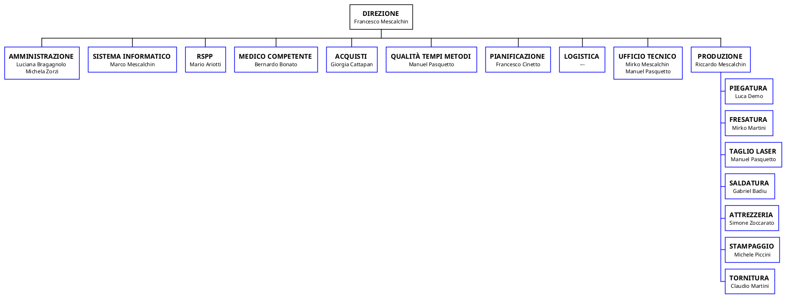

```plantuml
@startwbs
skinparam defaultTextAlignment center
  skinparam   distribute as tree


<style>
wbsDiagram {
  // all lines (meaning connector and borders, there are no other lines in WBS) are black by default
  Linecolor black
  arrow {
    // note that connector are actually "arrow" even if they don't look like as arrow
    // This is to be consistent with other UML diagrams. Not 100% sure that it's a good idea
    // So now connector are green
    LineColor green
  }
  :depth(0) {
      BackgroundColor white
      RoundCorner 0
      LineColor black
  }
    :depth(1) {
      BackgroundColor white
      LineColor blue
      LineStyle 0
      LineThickness 1.5
  }
    :depth(2) {
      LineStyle 0
            LineColor blue
      LineThickness 1.5
			 BackgroundColor white

  }
}
</style>
* <size:15><b>DIREZIONE</b></size> \nFrancesco Mescalchin
** <size:15><b>AMMINISTRAZIONE</b></size> \nLuciana Bragagnolo \nMichela Zorzi
** <size:15><b>SISTEMA INFORMATICO</b></size> \nMarco Mescalchin
** <size:15><b>RSPP</b></size> \nMario Ariotti
** <size:15><b>MEDICO COMPETENTE</b></size> \nBernardo Bonato
** <size:15><b>ACQUISTI</b></size> \nGiorgia Cattapan
** <size:15><b>QUALITÀ TEMPI METODI</b></size> \nManuel Pasquetto
** <size:15><b>PIANIFICAZIONE</b></size> \nFrancesco Cinetto
** <size:15><b>LOGISTICA</b></size> \n---
** <size:15><b>UFFICIO TECNICO</b></size> \nMirko Mescalchin \nManuel Pasquetto
** <size:15><b>PRODUZIONE</b></size> \nRiccardo Mescalchin
*** <size:15><b>PIEGATURA</b></size> \nLuca Demo
*** <size:15><b>FRESATURA</b></size> \nMirko Martini
*** <size:15><b>TAGLIO LASER</b></size> \nManuel Pasquetto
*** <size:15><b>SALDATURA</b></size> \nGabriel Badiu
*** <size:15><b>ATTREZZERIA</b></size> \nSimone Zoccarato
*** <size:15><b>STAMPAGGIO</b></size> \nMichele Piccini
*** <size:15><b>TORNITURA</b></size> \nClaudio Martini
@endwbs

```

