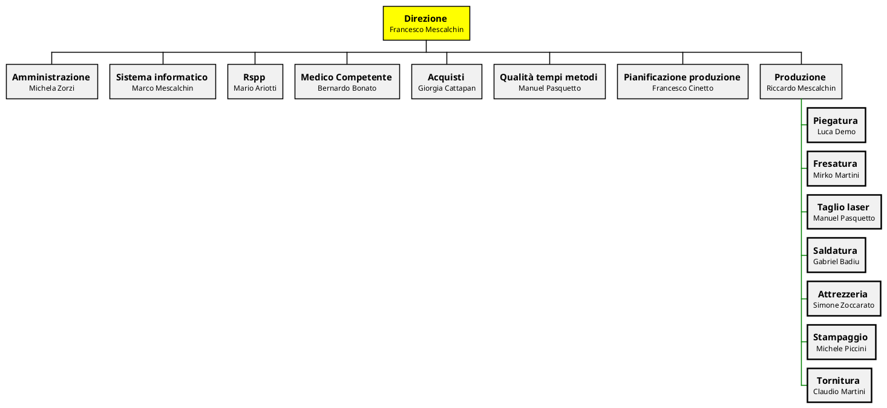

```plantuml
@startwbs
skinparam defaultTextAlignment center

<style>
wbsDiagram {
  // all lines (meaning connector and borders, there are no other lines in WBS) are black by default
  Linecolor black
  arrow {
    // note that connector are actually "arrow" even if they don't look like as arrow
    // This is to be consistent with other UML diagrams. Not 100% sure that it's a good idea
    // So now connector are green
    LineColor green
  }
  :depth(0) {
      // will target root node
      BackgroundColor Yellow
      RoundCorner 0
      LineColor BLACK
      // Because we are targetting depth(0) for everything, border and connector for level 0 will be red
  }
  arrow {
    :depth(2) {
      // Targetting only connector between Mexico-Chihuahua and USA-Texas
      LineColor blue
      LineStyle 0
      LineThickness .5
    }
  }
  node {
    :depth(2) {
      LineStyle 0
      LineThickness 2.5
    }
  }
  boxless {
    // will target boxless node with '_'
    FontColor darkgreen
  }  
}
</style>

* <size:15><b>Direzione</b></size> \nFrancesco Mescalchin
** <size:15><b>Amministrazione</b></size> \nMichela Zorzi
** <size:15><b>Sistema informatico</b></size> \nMarco Mescalchin
** <size:15><b>Rspp</b></size> \nMario Ariotti
** <size:15><b>Medico Competente</b></size> \nBernardo Bonato
** <size:15><b>Acquisti</b></size> \nGiorgia Cattapan
** <size:15><b>Qualità tempi metodi</b></size> \nManuel Pasquetto
** <size:15><b>Pianificazione produzione</b></size> \nFrancesco Cinetto
** <size:15><b>Produzione</b></size> \nRiccardo Mescalchin
*** <size:15><b>Piegatura</b></size> \nLuca Demo
*** <size:15><b>Fresatura</b></size> \nMirko Martini
*** <size:15><b>Taglio laser</b></size> \nManuel Pasquetto
*** <size:15><b>Saldatura</b></size> \nGabriel Badiu
*** <size:15><b>Attrezzeria</b></size> \nSimone Zoccarato
*** <size:15><b>Stampaggio</b></size> \nMichele Piccini
*** <size:15><b>Tornitura</b></size> \nClaudio Martini
@endwbs

```

